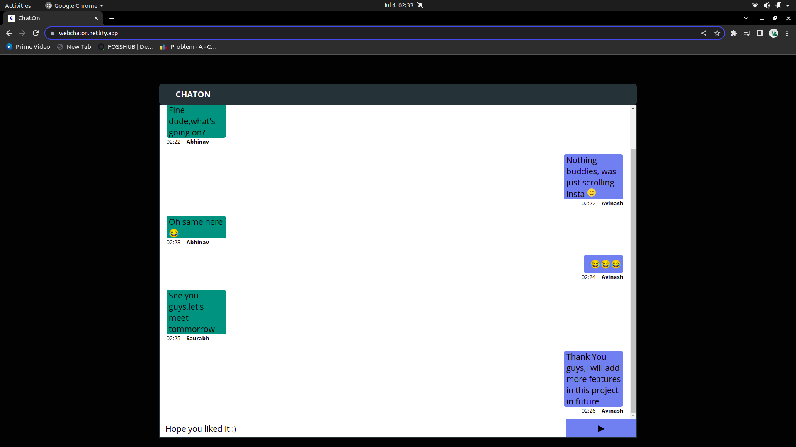

# ChatOn
  This application is built using Socket.io and ReactJs.
  
  

# Features
  <li>Mutliple users can join and chat in a room.</li> 
  <li>Real-time communication between a client and a server using Socket.io.</li>
  <li>You can send emoticons , features like scroll to bottom button and auto scroll on receiving a message are provided     using ReactJs.</li> 
   
# Installation

### Running Locally

Make sure you have Node.js and npm install.

  1. Clone or Download the repository 
    <pre>git clone https://github.com/abhinav-8/Chat-App.git
     Change [client/src/App.js/Line 6](https://github.com/abhinav-8/Chat-App/blob/0964a109b6b8fcece66cf5e5350366ba7fe633d2/client/src/App.js#L6) to "const socket = io.connect("http://localhost:3001");" to run server locally on port 3001</pre>
  2. Install Dependencies and run server
      <pre>$cd server       
     $npm install
     $npm start</pre>
  3. Install Dependencies and Start the Application 
      <pre>$cd client       
     $npm install
     $npm start</pre>
     
  Application runs on localhost:3000.
      
## How It Works

   Having an active connection opened between the client and the server so client can send and receive data. This allows real-time communication using TCP sockets. This is made possible by Socket.io.

   The client starts by connecting to the server through a socket(maybe also assigned to a specific namespace). Once connections is successful, client and server can emit and listen to events. 
   
   If multiple users try to join in the same room with same username,the user who joins first would be in and others would not be able to send or receive message in that room.
   
   ChatOn's backend is deployed on heroku and front-end on netlify. Live Link : https://webchaton.netlify.app/
   
   
    
  
  

